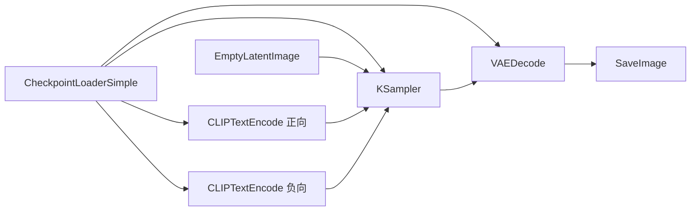

# LinScio MedComm 与 ComfyUI 绘图集成方案

## 1. 文档目的与范围

本文档描述 **LinScio MedComm**（医学科普写作客户端）与 **ComfyUI** 本地或云端实例的集成方式：工作流拓扑、与现有后端的衔接方式、环境变量与运维要点，以及后续扩展建议。

**范围包含**：文生图（T2I）API 工作流、与 `comfy_client` / `imagegen` 引擎的对接、默认 SDXL 示例工作流。

**范围不包含**：ComfyUI 本体的安装教程、具体模型版权与下载来源（由部署方自行合规获取）。

**配套文档**：节点/参数/基底模型与 LoRA 的编排选型见同目录 **[ComfyUI工作流编排设计方案.md](./ComfyUI工作流编排设计方案.md)**。

---

## 2. 背景与目标

### 2.1 产品侧诉求

MedComm 已具备多路图像生成能力（如 DALL·E、通义万相等），并通过 `prompt_builder` 将场景描述转为**英文主提示**，并附带医学科普场景的**安全负向词**（`SAFETY_NEGATIVE`）。ComfyUI 作为可选提供方时，应：

- 复用同一套正负向语义，保证与其他渠道风格、安全策略一致；
- 默认输出分辨率与 `imagegen` API 默认（如 1024×1024）对齐；
- 通过 HTTP API 提交工作流、轮询历史、下载 PNG，与现有 `comfy_client.submit_and_wait_image` 行为一致。

### 2.2 技术约束

- ComfyUI **官方 `/prompt` 接口**接受的 JSON 为 **API 格式**：顶层键为**字符串形式节点 ID**，值为含 `class_type` 与 `inputs` 的对象（与 UI 导出的「工作流 JSON」可能不同，需使用 **Save (API Format)** 或本文档提供的模板）。
- 后端 `comfy_client` 会按节点 ID **注入**正向/负向文本，并可选择性覆盖 **KSampler** 的 `seed`、`steps`、`cfg`、`sampler_name`。
- 当前实现**未**自动注入 `EmptyLatentImage` 的宽高；若需与前端任意 `width`/`height` 一致，需扩展客户端或准备多套工作流（见第 7 节）。

---

## 3. 系统架构

```
┌─────────────────┐     POST /prompt      ┌──────────────────┐
│ MedComm Backend │ ────────────────────► │ ComfyUI          │
│ imagegen/engine │     (workflow JSON)   │ (local :8188 或   │
│ comfy_client    │ ◄──────────────────── │  Comfy Cloud)    │
└─────────────────┘     history + /view   └──────────────────┘
        │
        ▼
  保存 PNG 至 LINSCIO_APP_DATA/images/...
  返回 medcomm-image:// 相对路径
```

**关键代码位置**（仓库内）：

| 模块 | 路径 | 职责 |
|------|------|------|
| ComfyUI 客户端 | `backend/app/services/imagegen/comfy_client.py` | 读 JSON、注入提示词与采样参数、提交、轮询、下载首图 |
| 引擎路由 | `backend/app/services/imagegen/engine.py` | `_comfyui()`、环境变量解析、与 `generate_image` 串联 |
| 提示词 | `backend/app/services/imagegen/prompt_builder.py` | 英文主提示、风格包、安全负向 |
| 示例工作流 | `workflows/comfyui/medcomm_t2i_sdxl.api.json` | SDXL 文生图 API 模板 |

---

## 4. 工作流设计（SDXL 文生图）

### 4.1 拓扑说明

采用经典 SDXL 链路：**加载 Checkpoint → 空 Latent → 双 CLIP 编码（正/负）→ KSampler → VAE Decode → SaveImage**。



### 4.2 与后端注入点的对应关系（示例节点 ID）

示例文件 `medcomm_t2i_sdxl.api.json` 采用下列 ID，**须与环境变量一致**：

| 节点 ID | 节点类型 | 后端用途 |
|---------|----------|----------|
| `1` | CheckpointLoaderSimple | 加载模型（仅本地改 `ckpt_name`） |
| `5` | EmptyLatentImage | 分辨率与 batch（默认 1024×1024） |
| `6` | CLIPTextEncode | **正向提示**（`COMFYUI_PROMPT_NODE_ID`，默认即为 6） |
| `7` | CLIPTextEncode | **负向提示**（需设置 `COMFYUI_NEGATIVE_NODE_ID=7`） |
| `3` | KSampler | **种子与步数等**（建议 `COMFYUI_KSAMPLER_NODE_ID=3`） |
| `8` | VAEDecode | 解码 |
| `9` | SaveImage | **必须存在**，否则客户端报「未找到输出图像」 |

若从 ComfyUI 界面重新导出 API JSON，节点数字会变化，需同步修改环境变量或 `comfy_overrides`。

---

## 5. 配置说明

### 5.1 环境变量（本地 ComfyUI）

| 变量 | 说明 | 示例 |
|------|------|------|
| `COMFYUI_WORKFLOW_JSON` | API 格式工作流文件绝对路径 | `.../workflows/comfyui/medcomm_t2i_sdxl.api.json` |
| `COMFYUI_BASE_URL` | ComfyUI 根地址 | `http://127.0.0.1:8188` |
| `COMFYUI_PROMPT_NODE_ID` | 正向 CLIP 节点 ID | `6`（默认） |
| `COMFYUI_PROMPT_INPUT_KEY` | 正向文本字段名 | `text`（默认） |
| `COMFYUI_NEGATIVE_NODE_ID` | 负向 CLIP 节点 ID | `7`（**建议显式设置**） |
| `COMFYUI_NEGATIVE_INPUT_KEY` | 负向文本字段名 | `text` |
| `COMFYUI_KSAMPLER_NODE_ID` | KSampler 节点 ID | `3`（**建议设置**，否则 seed/steps/cfg 不生效） |
| `COMFYUI_TIMEOUT_SEC` | 轮询超时（秒） | `300` |
| `COMFYUI_MODE` | `auto` / `local` / `cloud` | 与 `COMFY_CLOUD_API_KEY` 等配合 |

云端（Comfy Cloud）另需：`COMFY_CLOUD_API_KEY`，且 `COMFYUI_BASE_URL` 指向云端基址（代码内对 cloud 模式有 `/api` 前缀处理，见 `comfy_client._api_prefix`）。

### 5.2 工作流文件自检清单

1. 将 `medcomm_t2i_sdxl.api.json` 中 `CheckpointLoaderSimple.inputs.ckpt_name` 改为本机 `models/checkpoints/` 下**真实文件名**。  
2. 在 ComfyUI 中加载同结构工作流，确认能单次跑通；若有自定义节点，需保证运行环境一致。  
3. 若 Comfy 版本升级导致 `class_type` 或 `inputs` 字段变更，请用界面 **Save (API Format)** 重新导出并替换模板，同时更新本文档第 4.2 节表格中的节点 ID。

### 5.3 在 MedComm 中启用 ComfyUI 为提供方

- 确保 `COMFYUI_WORKFLOW_JSON` 指向有效文件（`detect_providers` 中 `comfyui_local` / `comfyui_cloud` 依赖此路径存在）。  
- 在图像生成请求中指定 `preferred_provider` 为 `comfyui` / `comfyui_local` / `comfyui_cloud`（具体以 `engine.generate_image` 与 API 层为准）。  
- 负向词由 `prompt_builder` 与 `SAFETY_NEGATIVE` 提供；**只有配置了 `COMFYUI_NEGATIVE_NODE_ID` 时**才会写入独立负向节点。

---

## 6. 参数与画风建议（医学科普）

| 参数 | 建议区间 | 说明 |
|------|----------|------|
| steps | 24–32 | 插画类约 28 步性价比高 |
| cfg | 6–8 | 过高易导致构图僵硬、伪文字增多 |
| sampler | euler、dpmpp_2m 等 | 与 `scheduler` 按 Comfy 默认组合即可 |
| 分辨率 | 1024×1024（默认） | 与当前 `EmptyLatentImage` 模板一致 |

画风与类型仍由 MedComm 的 `style`、`image_type` 与 `prompt_builder` 模板驱动；ComfyUI 侧以**同一套英文提示**接入，不重复维护一套文案逻辑。

---

## 7. 扩展与演进

| 方向 | 说明 |
|------|------|
| 动态宽高 | 在 `comfy_client` 中增加对指定节点（如 `5`）的 `width`/`height` 注入，与 `generate_image(width, height)` 对齐。 |
| SDXL Refiner | 增加第二阶段采样节点链；导出新的 API JSON 并更新节点 ID 配置。 |
| ControlNet | 适合流程图版式控制；需扩展工作流与可选「参考图」上传链路。 |
| 放大 | 在 `SaveImage` 前插入放大节点；注意超时与显存。 |
| Flux / 其他底座 | 更换 Loader 与 Latent 节点类型，重新导出 API JSON。 |

---

## 8. 风险与合规

- **模型与输出内容**：部署方需遵守模型许可与本地法规；医学示意图应避免误导性解剖或治疗承诺，与产品内安全负向词策略一致。  
- **本机安全**：本地 ComfyUI 默认无鉴权，不建议对公网暴露；生产若走云端，应使用 API Key 并限制来源。  
- **稳定性**：长链路工作流失败时，后端会记录警告并可能回退到其他提供方（取决于 `generate_image` 的 provider 排序逻辑）。

---

## 9. 附录

### 9.1 仓库文件

- 方案文档：本文 `workflows/comfyui/ComfyUI绘图集成方案.md`  
- 示例 API 工作流：`workflows/comfyui/medcomm_t2i_sdxl.api.json`

### 9.2 相关环境变量速查（复制用）

```bash
export COMFYUI_WORKFLOW_JSON="/绝对路径/linscio_medcomm/workflows/comfyui/medcomm_t2i_sdxl.api.json"
export COMFYUI_BASE_URL="http://127.0.0.1:8188"
export COMFYUI_PROMPT_NODE_ID="6"
export COMFYUI_PROMPT_INPUT_KEY="text"
export COMFYUI_NEGATIVE_NODE_ID="7"
export COMFYUI_NEGATIVE_INPUT_KEY="text"
export COMFYUI_KSAMPLER_NODE_ID="3"
export COMFYUI_TIMEOUT_SEC="300"
```

---

**文档版本**：与仓库 `medcomm_t2i_sdxl.api.json` 及 `comfy_client.py` 当前行为同步；工作流或接口变更时请同步修订本节与第 4.2 节节点表。
